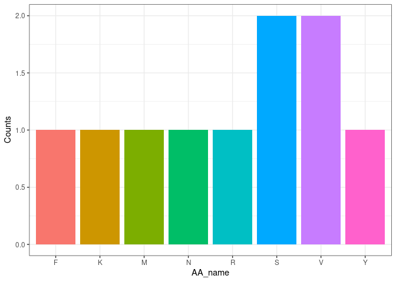

``` r
library(CentralDogma)
```

## Package Description

This package stimulates the process of the central dogma in biology,
namely the process of replication, transcription and translation. Five
main functions are included in this package so far.

## Functions

-   transcription(): It takes a DNA sequence as an input and returns the
    transcripted mRNA sequence as an output, which means all the “A”s
    are will be changed into “U”s.
-   AA_num_plot(): It takes an amino acid sequence as an input and
    returns the bar plot reflecting the number of each unique AA in the
    input sequence. The plot is saved as a variable called “AAplot” in
    inside of the function.

## Use Case

2.  For transcription():

``` r
transcription("ATCTA")
#> [1] "AUCUA"
```

5.  For AA_num_plot():

``` r
AAplot <- AA_num_plot("MFVVYNKRSS")
AAplot
```

<!-- -->

## Discussion for T4

-   The dependencies are needed for the fifth function AA_num_plot(). We
    typed *usethis::use_package(“package_name”)* three times to add
    “ggplot”, “magrittr” and “stringr” into the DESCRIPTION file. Inside
    of the funcion file, we added *@importFrom magrittr %\>%* in order
    to use the Tidyver pipe to our package namespace.

-   Disadvantages for not limiting the number of dependencies:

    -   Anyone installing your package must also install the dependency
        (which you’ve written about).
    -   Anyone loading your package must also load all dependencies,
        even if only into “background” namespaces.
    -   Your package’s code is affected by dependencies.

-   *package::function()* Vs. *@importFrom package function*:

    -   If you are using just a few functions from another package, then
        it’s better to note the package name in the **Imports:** field
        of the DESCRIPTION file and call the function(s) explicitly
        using **::**, e.g., *pkg::fun()*.
    -   If you are using functions repeatedly, you can avoid **::** by
        importing the function with *@importFrom pkg fun*.
